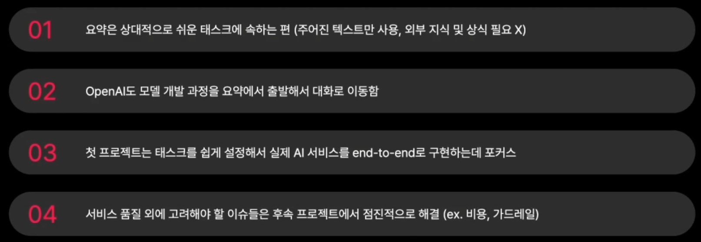
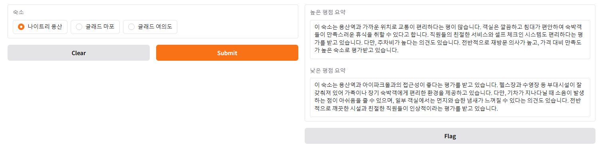
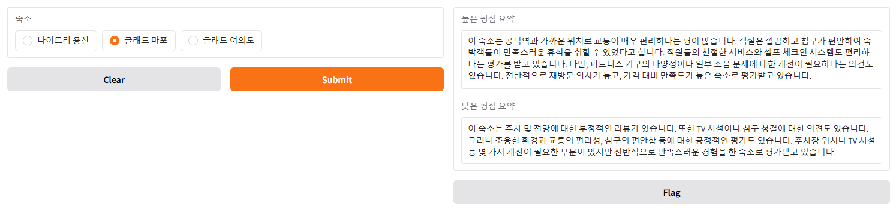
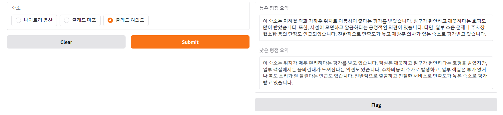

# 야놀자 리뷰 요약 프로젝트
## 📌 프로젝트 소개
- 해당 프로젝트는 **야놀자 숙소 리뷰를 요약**하여 사용자에게 제공해주는 편의 서비스를 개발하는 프로젝트입니다.
- 개인으로 진행하며, 데이터 수집, 가공 등의 전처리 과정과 모델 고도화 작업을 진행합니다.

---
## 🌟 프로젝트 선정이유


---
## 📁 프로젝트 구조


---
## 🎮 주요 수행
- 1. 야놀자 [나인트리 프리미어 로카우스 호텔 서울 용산] 리뷰 데이터 크롤링
- 2. 리뷰 데이터 전처리
- 3. 평가 기준 설정 및 Baseline 모델 개발
- 4. 비교군 테스트 및 대규모 평가 스크립트 작성
- 5. 모델 고도화 1 - 프롬프트 조건 명시
- 6. 모델 고도화 2 - 입력 데이터 재 전처리
- 7. 모델 고도화 3 - few-shot prompting 및 few-shot을 위한 데이터 크롤링(글래드 마포, 글래드 여의도)
- 8. 데모 제작 - gradio

---
## 🛠 기술 스택
- python, bs4, Selenium, openai, gradio

---
## 💻 설치 및 실행 방법
```
pip install -r requirements.txt
```

---
## 결과
### 1. 나이트리 용산 호텔 결과


### 2. 글래드 마포 호텔 결과


### 3. 글래드 여의도 호텔 결과


---
